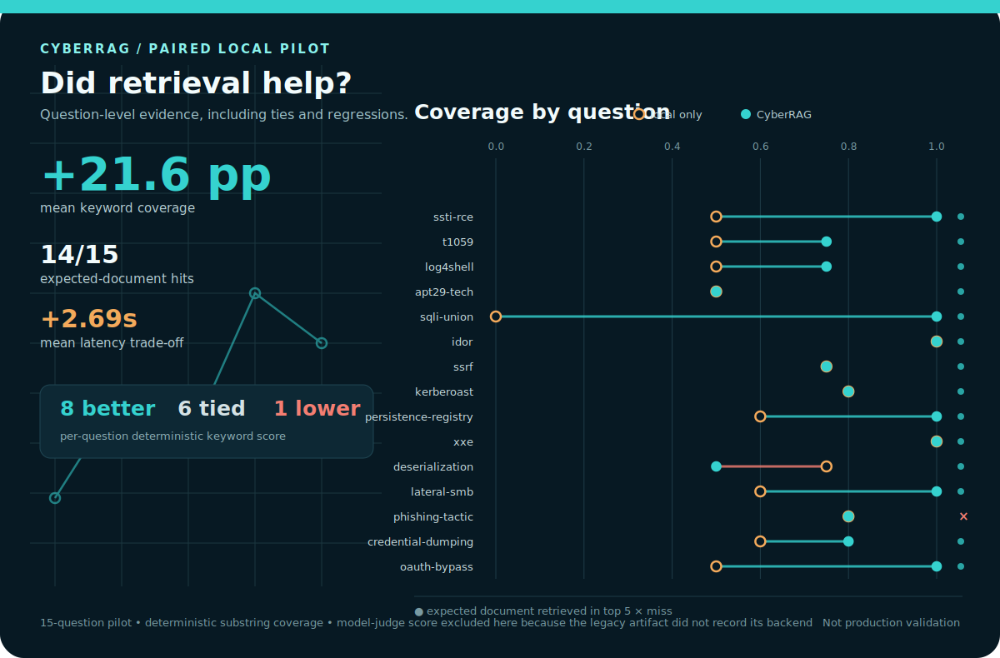
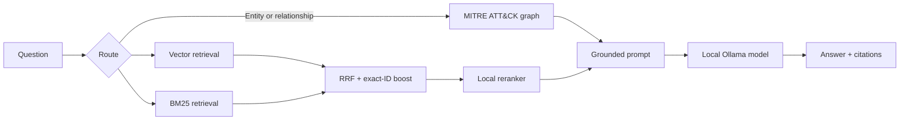

# CyberRAG

**A fully local cybersecurity RAG prototype with hybrid retrieval, MITRE ATT&CK graph grounding, cited answers, and a repeatable evaluation harness.**



*Generated from the checked-in 15-question pilot snapshot. Mean deterministic
keyword coverage increased from 0.627 to 0.843, expected documents appeared in
the top five for 14/15 questions, and mean latency increased by 2.694 seconds.
This is a small local pilot, not production validation or cloud-model parity.*

I built CyberRAG to explore a practical question: how much can retrieval improve
a small local model on threat-intelligence tasks while keeping query-time data
on the user's machine?

I began the project in response to a CyberSecurity Malaysia challenge brief. It
is an independent prototype, not an official commission, deployment, or endorsed
CyberSecurity Malaysia product.

## What it demonstrates

- **Private query path:** embeddings, retrieval, reranking, graph lookup, and generation run through local Ollama models.
- **Hybrid retrieval:** dense vectors + BM25 + reciprocal-rank fusion, with exact boosts for CVE, ATT&CK, CAPEC, and CWE identifiers.
- **Graph grounding:** MITRE ATT&CK relationships support multi-hop questions about groups, malware, techniques, and mitigations.
- **Evidence-first answers:** retrieved passages and graph facts are passed to a prompt that requires inline citations and refuses unsupported identifiers.
- **Evaluation as engineering:** a fixed question set measures keyword coverage, retrieval hit rate, model-judge score, and latency.

## Pilot benchmark

The committed [15-question result snapshot](eval/results_2026-06-22_1901.json) compares the same local model with and without CyberRAG:

| Metric | Local model only | Local model + CyberRAG |
|---|---:|---:|
| Keyword coverage | 0.627 | **0.843** |
| Context hit rate | — | **0.933** |
| Model-judge score | 0.427 | **0.647** |
| Mean latency | 11.95 s | 14.65 s |

The deterministic metrics show stronger factual coverage and retrieval. The model-judge result is directional: the original snapshot did not record whether each score came from the external judge or the local fallback. The current runner records the selected judge backend so future results are auditable.

This is a small pilot benchmark, not proof of general cloud-model parity or production readiness.

## Architecture



| Layer | Default implementation |
|---|---|
| Embeddings | `nomic-embed-text` through Ollama |
| Vector store | ChromaDB, stored locally |
| Lexical retrieval | BM25 |
| Rank fusion | Reciprocal Rank Fusion + exact-ID boost |
| Knowledge graph | NetworkX over MITRE ATT&CK STIX |
| Generator / reranker | `qwen2.5-coder:7b` through Ollama |

See [docs/ARCHITECTURE.md](docs/ARCHITECTURE.md) for the design details.

## Quick start

### Requirements

- Python 3.11+
- [Ollama](https://ollama.com/) running locally
- Enough local storage and memory for the selected model and generated indexes

```bash
git clone https://github.com/Labeeb2339/cyber-rag.git
cd cyber-rag

python -m venv .venv
# Windows: .venv\Scripts\activate
# Linux/macOS: source .venv/bin/activate
python -m pip install -r requirements.txt

ollama pull nomic-embed-text
ollama pull qwen2.5-coder:7b
```

Override the defaults without editing code by setting `CYBERRAG_GEN_MODEL` or `CYBERRAG_EMBED_MODEL`.

### Build the public-data indexes

This setup phase downloads authoritative public sources and therefore uses the network:

```bash
python ingest/fetch_authoritative.py
python ingest/build_index.py
python rag/hybrid.py build
python rag/kg.py build
```

After the sources and indexes exist, the normal query path is local:

```bash
python demo.py "Which techniques does APT29 use and how can they be detected?"
```

### Add your own documents

```bash
python ingest/ingest_docs.py ./my_reports --source internal-cti --recursive
python rag/hybrid.py build
```

Supported document formats include PDF, DOCX, Markdown, text, and HTML. Do not commit private documents, generated indexes, or embedding caches.

To add a custom source to a full rebuild without editing the code:

```bash
python ingest/build_index.py --extra-source "my-notes=./notes/*.md"
```

## Evaluation

```bash
# Local model only vs local model + CyberRAG
python eval/run_eval.py

# Add a local model judge; the backend is recorded in the output
python eval/run_eval.py --judge --judge-backend local

# Use an external command that reads the prompt from stdin
set CYBERRAG_EVAL_COMMAND=your-evaluator-command
python eval/run_eval.py --judge --judge-backend command --cloud
```

Cloud evaluation is optional and is never part of the normal CyberRAG query path. Using `--cloud` or `--judge-backend command` may send benchmark prompts to the configured external service.

## Tests

```bash
python -m pytest -q
```

The unit tests cover tokenization, stopword handling, exact security-identifier extraction, reciprocal-rank fusion, and deterministic evaluation metrics. Full end-to-end evaluation additionally requires Ollama plus generated corpus/index files.

Verify that the README benchmark graphic still matches the checked-in snapshot:

```bash
python scripts/generate_readme_assets.py --check
```

## Repository boundaries

Included:

- ingestion and query source code;
- evaluation questions and a dated result snapshot;
- architecture and executive documentation.

Not included:

- generated Chroma/BM25/graph indexes;
- downloaded corpora;
- private incident reports or operational SOC data;
- evidence of production deployment or formal security certification.

## License

MIT — see [LICENSE](LICENSE).
