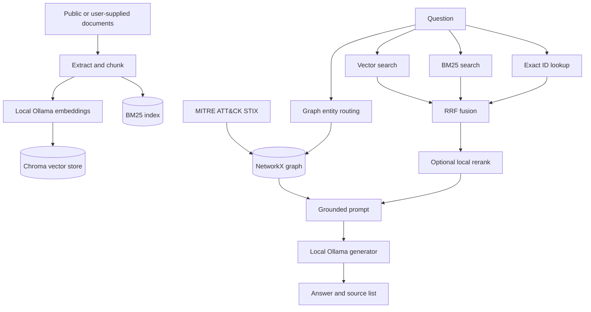

# CyberRAG Architecture

CyberRAG is a local-first research prototype for evidence-grounded cybersecurity questions. The architecture separates ingestion, retrieval, graph lookup, generation, and evaluation so each layer can be tested independently.

## Data flow

## Components

- `ingest/fetch_authoritative.py` downloads public source material. This is a networked setup step.
- `ingest/build_index.py` chunks documents, creates local embeddings, and writes Chroma data.
- `ingest/ingest_docs.py` adds user-owned documents without changing repository source.
- `rag/hybrid.py` implements vector search, BM25, exact-ID lookup, RRF, and optional reranking.
- `rag/kg.py` builds and queries a MITRE ATT&CK relationship graph.
- `rag/engine.py` combines graph facts and retrieved passages into the grounded prompt.
- `eval/run_eval.py` runs fixed-question comparisons and records the requested judge backend.

## Retrieval rules

Dense retrieval is useful for semantic similarity. BM25 is useful for exact names, technique IDs, and CVE identifiers. Reciprocal-rank fusion combines both without assuming comparable score scales. An exact identifier found in the query receives a dominant boost when the same identifier occurs in a candidate.

The graph route activates only for entity or relationship questions that resolve to a known ATT&CK node. Graph facts and passages remain distinct in the prompt and use different citation labels.

## Local and network boundaries

Normal query execution uses local Ollama models, local Chroma/BM25 indexes, and a local NetworkX graph. Network access is required when fetching the public corpus. External evaluation is also networked when `CYBERRAG_EVAL_COMMAND` invokes a hosted service.

"Local query path" does not by itself prove zero egress. A deployment should still verify host networking, telemetry, package behaviour, logs, and operating-system controls.

## Generated and sensitive data

The repository ignores downloaded corpora, vector indexes, BM25 pickles, graph pickles, test documents, and evaluation logs. Private incident reports must never be committed. Custom sources are passed explicitly with `--extra-source LABEL=GLOB`; the code contains no author-specific filesystem paths.

## Evaluation limits

The committed snapshot contains 15 questions. It is useful for regression testing, especially exact-ID failures, but is too small to establish general model quality. The original result did not record whether every model-judge score came from the external evaluator or a local fallback. The current runner removes that silent fallback and records the selected backend.
